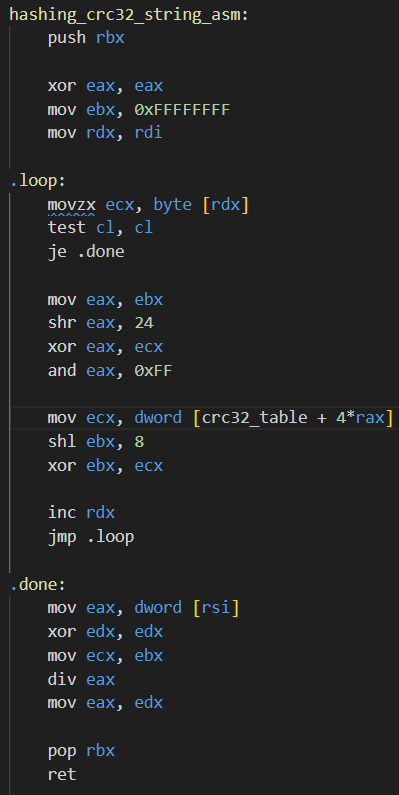
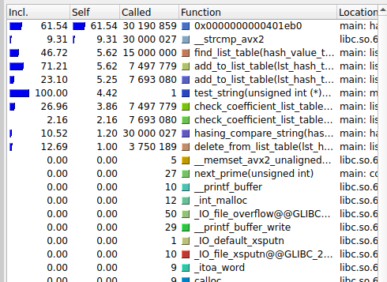
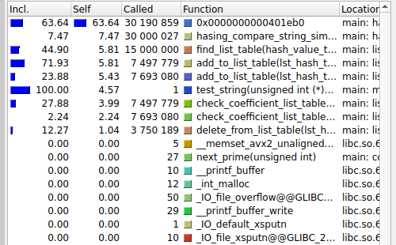

**Задача**

Задача оптимизировать хеш-таблицу с завышенным Load factor. Будет использоваться решение колизей методом цепочек. Мы будем использовать таблицу с Load factor  = 15. В качестве данных для хеширования будет использоваться 10^6 рандомно сгенерированных слов 

**Характеристики входных данных**

------------------
|кол-во Слов | 10^6|
|длинна слов | 5- 20 символов|
|буквы|английские|
-----------------

**Методика измерений**
---------------------------
|Характеристики компьютера|
---------------------------
|CPU| ryzen 7 5000 series|
|ограничение частоты CPU| 0.5ГГц |
----------------------------------

В ходе измерений частота процессора была искусственно ограничена до 50% от максимальной, для уменьшения погрешности, связанной с колебаниями частоты. Поскольку испытуемый компьютер работает на Windows, не было найдено способов лучше стабилизировать частоту процессора (в биосе!!!). Во время испытаний ноутбук был постоянно подключён к зарядке и стоял на ровной поверхности стола)))). (Для уменьшения зависимости от питания и перегрева) 

При расчёте времени учитывалось только время, затраченное на операции добавления в таблицу, удаления, поиска. Таким образом, время, затраченное на закачку массива слов в память и отчистку памяти, не учитывалось. (СПЕЛЧЕКЕР!)

Компиляция всех пунктов, кроме 0го происходили с флагом -O3.
Расчёты происходили по следующим формулам:

    $\langle t \rangle = \frac{1}{n} \sum_{i=1}^{n} t_i$
    $\sigma_t = \sqrt{\frac{1}{n} \sum_{i=1}^{n} (t_i - \langle t \rangle)^2}$
    $\sigma_{\text{cp}} = \frac{\sigma_t}{\sqrt{n}}$
    $t = \langle t \rangle \pm \sigma_{\text{cp}}$

    =((

**Измерения**

*Запуск 0(без флагов оптимизации)*

---------------------
 |Измерение|Время, c|
---------------------
|1|13.0317;|
|2|12.9597;|
|3|13.2083;|
|4|13.1298;|
|5|13.2644;|
|6|13.1325;|
|7|13.2282;|
----------

$\langle t \rangle = 13.1363$ нафига

$\sigma_t = 0.3762$нафига

$\sigma_{\text{cp}} = 0.1015$нафига

$t = 13.13 \pm 0.10$

*Запуск 1*
На этом этапе программа не менялась, но был добавлен флаг компиляции -O3
---------------------
 |Измерение|Время, c|
---------------------
|1|11.8974|
|2|12.0724|
|3|11.9904|
|4|12.2349|
|5|12.2723|
|6|11.8287|
|7|12.0282|
----------

$\langle t \rangle = 12.046$
$\sigma_t = 0.1512$
$\sigma_{\text{cp}} = 0.0571$
\$t = 12.05 \pm 0.06$

*Запуск 2*

Профайлинг программы показывает, что наибольшее время выполняется функция хеширования строки. Поэтому я заменил её на ассемблерный вариант. В этом варианте было достигнуто минимальное (которое я придумал) кол-во используемых регистров (на колво регистров пофиг), а так же минимально -кол-во обращений к памяти.

Остальные функции не были изменены, флаги компиляции остались те же, ключ рандома не менялся. 

Измерения времени работы этой версии программы с этим вариантом функции, показал прирост производительности в $12.046/5.5232 = 2.66$ раза.

БЫЛО/СТАЛО

можно попробовать -flto (link time optimization)

Результаты с учётом запуска с асм функцией хеширования. (Компилировано с флагом -O3)
---------------------
 |Измерение|Время, c|
---------------------
|1|4.5183|
|2|4.5154|
|3|4.5003|
|4|4.5155|
|5|4.5232|
|6|4.4927|
|7|4.5838|
-----------
$\langle t \rangle = 4.5232$
$\sigma_t = 0.0295$
$\sigma_{\text{cp}} = 0.0103$
$t = 4.5232 \pm 0.0103$

*Запуск 3*

Профайлинг программы после улучшения функции хеширования. Он показывает что не смотря на сильное увеличение производительности программы (zap9tie). Попробуем увеличить скорость работы следующей за ней функцией Strcmp.

Оригинальный strcmp возвращает  $a > 0 || a < 0 || a = 0$ в зависимости от соотношения длин и содержания строк. Однако в хэш таблице достаточно информации о том, равны ли строки $a ?= 0$. Упростив это сравнение можно получить прирост производительности.

Также можно воспользоваться SIMD функциями для того, чтобы сравнивать за раз набор байт.
Для этого придётся дополнять каждое слово '\0' до размера памяти использующего эту инструкцию.
Согласно результатам гуглинга средняя длина слов в английском языке не больше 5-6 букв. Таким образом, использование 256 битных сранительных конструкций излишне тк 
1. Сильное переиспользование памяти
2. Из за своего размера большие SIMD (256 бит) инструкции выполняются дольше, при этом часто SIMD инструкция будет обрабатывать не используемую память. (неправда, check intel manual)

БЫЛО / СТАЛО

Остальные функции не были изменены, флаги компиляции остались те же, ключ рандома не менялся.

Результаты измерений:
---------------------
 |Измерение|Время, c|
---------------------
|1|4.3657|
|2|4.3856|
|3|4.1782|
|4|4.3691|
|5|4.3523|
|6|4.3563|
|7|4.2992|
-----------

$\langle t \rangle = 4.3523$
$\sigma_t = 0.07401$
$\sigma_{\text{cp}} = 0.0279$
$t = 4.3523 \pm 0.0279$

*Запуск 4*

Профалинг после замены strcmp и функции хеширования:
Как и в прошлый раз, нам не удалось достичь цели по снижению позиций в рейтинге по количеству затраченного времени на функцию.
Далее была переписана на инлайн ассемблер функция поиска тк она была следующей, за уже улучшенными.
Аналогично, как и с м улучшением код функции был переработан на ассемблер и попыткой минимизировать использование регистров и обращения к памяти. 

Остальные функции не были изменены, флаги компиляции остались те же, ключ рандома не менялся.

Результаты измерений:
---------------------
 |Измерение|Время, c|
---------------------
|1|4.2694;|
|2|4.2857;|
|3|4.2974;|
|4|4.4073;|
|5|4.2827;|
|6|4.3028;|
|7|4.2792;|
-----------

$\langle t \rangle = 4.3035$
$\sigma_t = 0.0436$
$\sigma_{\text{cp}} = 0.0164$
$t = 4.3035 \pm 0.0164$

Итоговое улучшение по сравнению с первой версией: $12.046/43.3035 = 2.8$ раз Коэффициент улучшения (70 - кол-во асм строк) $k = 2.8/70 = 0.04$