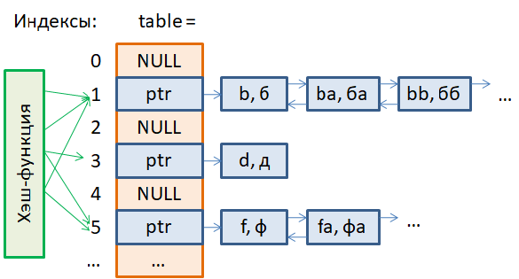

# Лабораторная работа: Реализация хеш-таблицы методом цепочек

## Теоретическое введение

### Определение хэш-функции:
Функция $h: K \rightarrow {0,...,m-1}$, где:
- $K$ - множество ключей
- $m$ - размер таблицы

### Определение хэш таблицы:
Хеш-таблица - это структура данных, реализующая отображение:
$T: K \rightarrow V$
где:
- $K$ - множество ключей
- $V$ - множество значений
- Реализуется через массив $A$ размером $m$ и хеш-функцию &h: K \rightarrow {0,...,m-1}$

Она поддерживает операции:
- Вставка 
- Удаление
- Поиск

### Определение коллизии:
Коллизия возникает, когда для двух различных ключей $k_1, k_2 \in K$ хеш-функция возвращает одинаковое значение:
$h(k_1) = h(k_2)$ при $k_1 \neq k_2$

### Решение коллизий методом цепочек:
Метод цепочек - это способ организации хеш-таблицы, где:
$T = [L_0, L_1, ..., L_{m-1}]$
где:
- $L_i$ - связный список значений
- $m$ - размер таблицы
Все ключи с $h(k) = i$ хранятся в соответствующем списке $L_i$

### Определение LoadFactor:
$loadFactor = n/m$
где:
- $n$ - текущее количество элементов
- $m$ - размер хеш-таблицы (количество корзин)

### 2. Метод цепочек (chaining)
Способ разрешения коллизий, при котором:
- Каждая ячейка таблицы содержит связный список
- Элементы с одинаковым хешем добавляются в список

https://proproprogs.ru/structure_data

## **Задача**

Задача оптимизировать хеш-таблицу с завышенным $Load factor$. Будет использоваться решение колизей методом цепочек. Мы будем использовать таблицу с $Loadfactor  = 15$. В качестве данных для хеширования будет использоваться $10^6$ рандомно сгенерированных слов 

## **Характеристики входных данных**

|кол-во Слов | $10^6$ |
|------------|------|
|длинна слов |5 - 20 символов|
|буквы       |английские|

## **Методика измерений**

|Характеристики компьютера| |
|---|---------------------|
|CPU| ryzen 7 5000 series|
|ограничение частоты CPU| 1 ГГц |
|RAM|16Gb|

В ходе измерений частота процессора была искусственно ограничена до 50% от максимальной, для уменьшения погрешности, связанной с колебаниями частоты. 
Программа закусалась изолированно на ядре 0. С помощью "taskset -c 0 ./prog"

При расчёте времени учитывалось только время, затраченное на операции добавления в таблицу, удаления, поиска. Таким образом, время, затраченное на закачку массива слов в память и отчистку памяти, не учитывалось.

Профайлинг будет производиться с помощью программы valgrind.

Компиляция всех пунктов, кроме 0го происходили с флагом -O3.
Расчёты происходили по следующим формулам:

$\langle t \rangle = \frac{1}{n} \sum_{i=1}^{n} t_i$

$\sigma_t = \sqrt{\frac{1}{n} \sum_{i=1}^{n} (t_i - \langle t \rangle)^2}$

$\sigma_{\text{cp}} = \frac{\sigma_t}{\sqrt{n}}$

$t = \langle t \rangle \pm \sigma_{\text{cp}}$

### **Измерения**

*Запуск 0(без флагов оптимизации)*

|Измерение|Время, c|
|---------|--------|
|1|9.63432|
|2|9.55561|
|3|9.44292|
|4|9.72832|
|5|9.29832|
|6|9.85369|
|7|9.76902|

$t = 9.610 \pm 0.194$

### **Запуск 1**

На этом этапе программа не менялась, но был добавлен флаг компиляции -O3
 |Измерение|Время, c|
|----------|--------|
|1|8.1194;|
|2|8.0724;|
|3|7.9904;|
|4|8.1092;|
|5|8.0723;|
|6|8.0828;|
|7|8.0282;|
----------

\$t = 8.067 \pm 0.045$

### **Запуск 2**

Профайлинг программы показывает, что наибольшее время выполняется функция хеширования строки. Поэтому она была заменена на ассемблерный вариант. В этом варианте было достигнуто минимальное (которое я придумал) кол-во используемых регистров (на колво регистров пофиг), а так же минимально -кол-во обращений к памяти.

Остальные функции не были изменены, флаги компиляции остались те же, ключ рандома не менялся. 

Результаты с учётом запуска с асм функцией хеширования. (Компилировано с флагом -O3)

|Измерение|Время, c|
|---------|--------|
|1|7.086|
|2|6.892|
|3|7.058|
|4|6.970|
|5|7.109|
|6|6.999|
|7|6.958|

$t = 7.000 \pm 0,077$

Измерения времени работы этой версии программы с этим вариантом функции, показал прирост производительности в $12.046/5.5232 = 2.66$ раза.

### **Запуск 3**

Профайлинг программы после улучшения функции хеширования. Он показывает что не смотря на сильное увеличение производительности программы (zap9tie). Попробуем увеличить скорость работы следующей за ней функцией Strcmp.

Оригинальный strcmp возвращает  $a > 0 || a < 0 || a = 0$ в зависимости от соотношения длин и содержания строк. Однако в хэш таблице достаточно информации о том, равны ли строки $a ?= 0$. Упростив это сравнение можно получить прирост производительности.

Также можно воспользоваться SIMD функциями для того, чтобы сравнивать за раз набор байт.
Для этого придётся дополнять каждое слово '\0' до размера памяти использующего эту инструкцию.
Согласно результатам гуглинга средняя длина слов в английском языке не больше 5-6 букв. Таким образом, использование 256 битных сранительных конструкций излишне тк 
1. Сильное переиспользование памяти
2. Из за своего размера большие SIMD (256 бит) инструкции выполняются дольше, при этом часто SIMD инструкция будет обрабатывать не используемую память. (неправда, check intel manual)

Остальные функции не были изменены, флаги компиляции остались те же, ключ рандома не менялся.

Результаты измерений:

|Измерение|Время, c|
|---------|--------|
|1|6.2776|
|2|6.3256|
|3|6.3119|
|4|6.3691|
|5|6.3375|
|6|6.2563|
|7|6.2992|

$t = 6.312 \pm 0.0335$

### **Запуск 4**

Профалинг после замены strcmp и функции хеширования:
Как и в прошлый раз, нам не удалось достичь цели по снижению позиций в рейтинге по количеству затраченного времени на функцию.
Далее была переписана на инлайн ассемблер функция поиска тк она была следующей, за уже улучшенными.
Аналогично, как и с м улучшением код функции был переработан на ассемблер и попыткой минимизировать использование регистров и обращения к памяти. 

Остальные функции не были изменены, флаги компиляции остались те же, ключ рандома не менялся.

Результаты измерений:

|Измерение|Время, c|
|---------|--------|
|1|5.4747;|
|2|5.4941;|
|3|5.3974;|
|4|5.4892;|
|5|5.5883;|
|6|5.5270;|
|7|5.5849;|

$t = 5.494 \pm 0.065$

## Выводы:
Итоговое улучшение по сравнению с первой версией: $9.610/5.494 = 1.749$ раз Коэффициент улучшения (70 - кол-во асм строк) $k = 1.75/76 = 0.023$